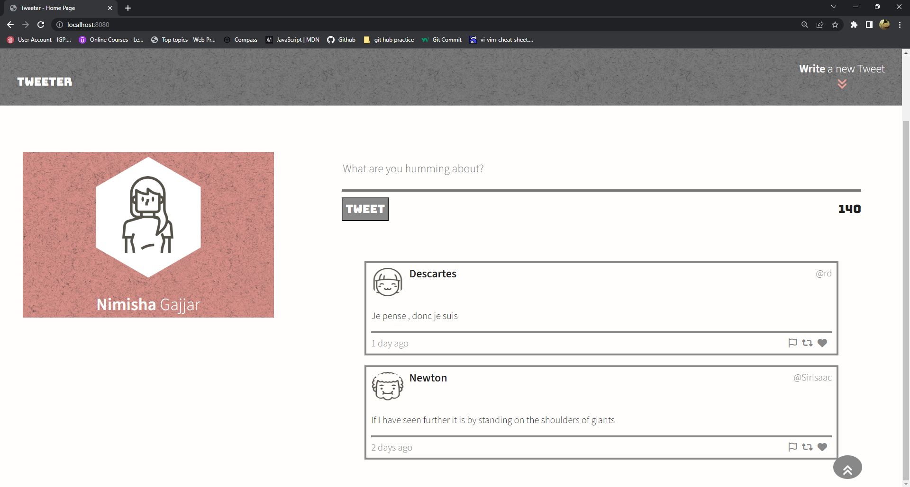
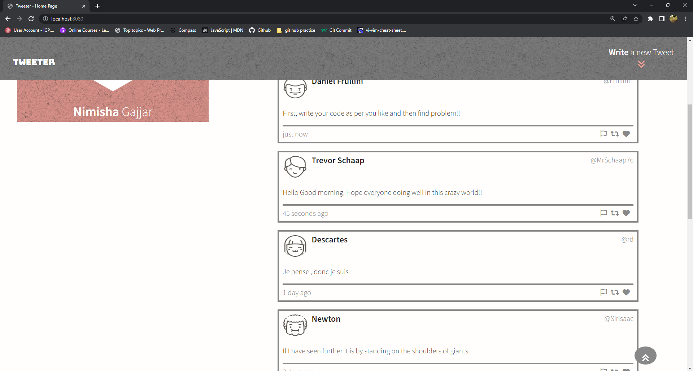
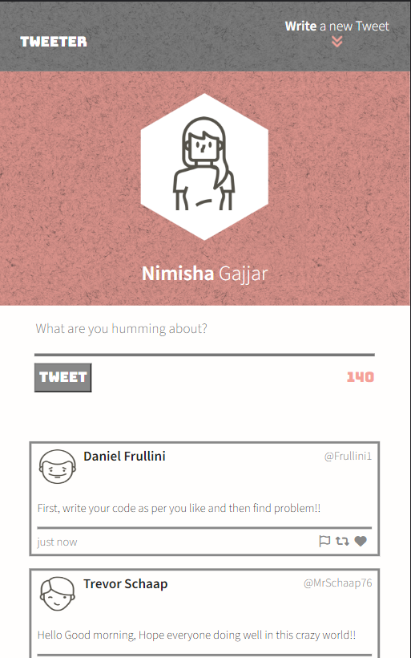
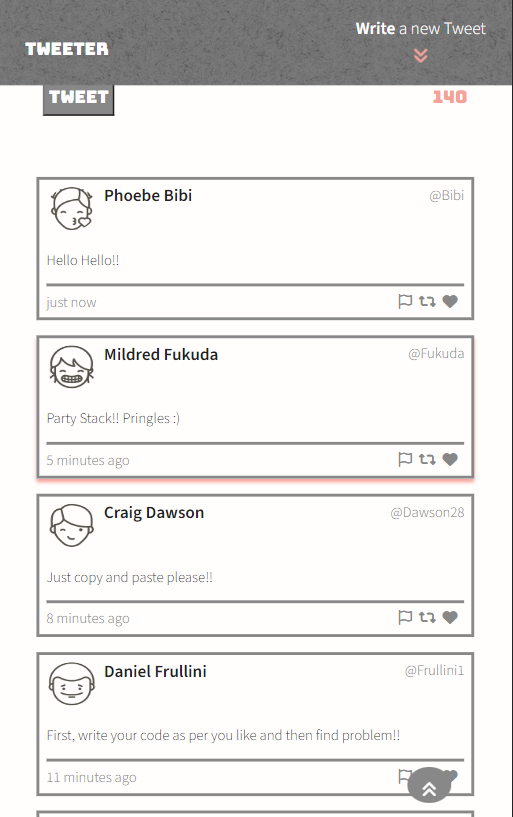

# Tweeter Project

Tweeter is a simple, single-page Twitter clone. Users can input their tweets at the top of the page into the tweet box and then the tweets are rendered onto the page with additional user info such as the username, handle, timestamp and avatar. There are several dynamic alements build into the app such as character counter & client side code which renders error messages onto the page for empty and lengthy tweets, and buttons on the bottom of the page that allow the user to immediately scroll to up and focus on the tweet input textarea. The app also has a responsive design with different page layouts for mobile, tab and desktop use (top 2 screenshots below are the desktop design, and the bottom 2 are tab).

The goal of the project is to build upon HTML, CSS, JS, jQuery and AJAX front-end skills, and Node, Express.

# Screenshots

## Dependencies

- Express
- Node 5.10.x or above
- Chance

## Getting Started

1. Fork this repository, then clone your fork of this repository.
2. Install dependencies using the "npm install" command.
3. Start the web server using the npm run local command. The app will be served at http://localhost:8080/.
4. Go to http://localhost:8080/ in your browser.

